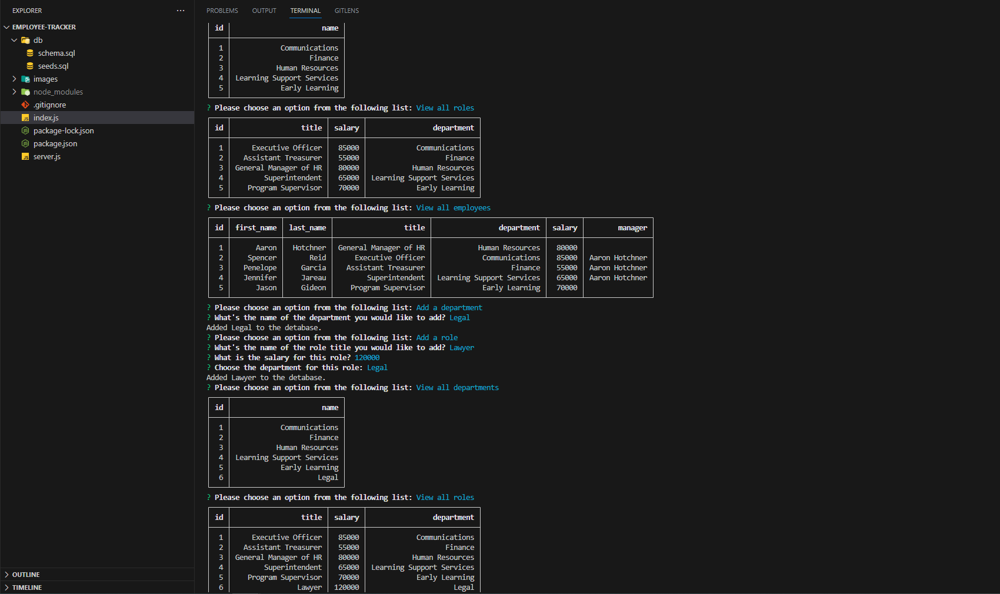

# Employee Tracker

## Description
This is a command-line application that takes in user input and helps manage employee data, department data and role data in company.  
It is very useful to any business owner.  

## Installation:
Run "npm install" before running the application by typing "node index.js". 

## Usage
After running "node index.js" answer the questions. After every answered question press "Enter"

Preview:

Video walk-through:

[Employee-Tracker-Video](https://drive.google.com/file/d/1-hW3WXjBqDWNXZewahDopXpe--ezh4k1/view)

## License
Please refer to the LICENSE in the repo.
